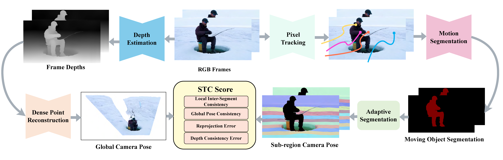

# Measuring 3D Spatial Geometric Consistency in Dynamically Generated Videos

---

<p align="center">
  
</p>
<p align="center">
  <em>Overview of the SGC computation pipeline. Input RGB frames undergo parallel processing: (i) depth estimation, leading to dense point reconstruction for global camera pose estimation; and (ii) pixel tracking followed by motion segmentation to isolate moving objects. The identified static background is then adaptively segmented. Local camera poses for these static sub-regions are subsequently estimated using information from pixel tracks and depth. Finally, the overall SGC score is computed by aggregating four key evaluations: local inter-segment consistency, global pose consistency (comparing local estimates against the global camera motion), reprojection error, and cross-frame depth consistency.</em>
</p>

---

## 📝 Contents

- [Measuring 3D Spatial Geometric Consistency in Dynamically Generated Videos](#measuring-3d-spatial-geometric-consistency-in-dynamically-generated-videos)
  - [📝 Contents](#-contents)
  - [📄 Abstract](#-abstract)
  - [🛠️ Installation](#️-installation)
  - [🚀 Usage](#-usage)
    - [Data Preparation](#data-preparation)
    - [Running SGC Metric](#running-sgc-metric)
  - [📊 Evaluation](#-evaluation)
    - [Evaluation Setup](#evaluation-setup)
    - [Datasets](#datasets)
    - [Key Results and Comparisons](#key-results-and-comparisons)

---

## 📄 Abstract

Recent generative models can produce high-fidelity videos, yet they often exhibit 3D spatial geometric inconsistencies. Existing evaluation methods fail to accurately characterize these inconsistencies: fidelity-centric metrics like FVD are insensitive to geometric distortions, while consistency-focused benchmarks often penalize valid foreground dynamics. To address this gap, we introduce SGC, a metric for evaluating 3D **S**patial **G**eometric **C**onsistency in dynamically generated videos. We quantify geometric consistency by measuring the divergence among multiple camera poses estimated from distinct local regions. Our approach first separates static from dynamic regions, then partitions the static background into spatially coherent sub-regions. We predict depth for each pixel and estimate a local camera pose for each subregion and compute the divergence among these poses to quantify geometric consistency. Experiments on real and generative videos demonstrate that SGC robustly quantifies geometric inconsistencies, effectively identifying critical failures missed by existing metrics.

---

## 🛠️ Installation

For detailed installation instructions, please refer to the **[Installation Guide](docs/Install.md)**.

Please see `docs/Install.md` for a comprehensive guide on setting up the environment, dependencies, and any required submodules.

---

## 🚀 Usage

### Data Preparation

Our SGC metric can process video files directly or pre-extracted frames. Please organize your data as described below.

**1. For Your Custom Videos/Frames:**

You have two options for providing your own video data:

- **Option A: Video Files**
  If you are using video files directly, place them in a directory:

  ```
  your_dataset/
  ├── video1.mp4
  ├── experiment_A_video.avi
  ├── another_sample.mov
  └── ...
  ```

- **Option B: Pre-extracted Frames**
  If you have already extracted frames from your videos, organize them into sub-directories, where each sub-directory corresponds to a single video:
  ```
  your_dataset_frames/
  ├── video1/               # Corresponds to 'video1.mp4' or a video named 'video1'
  │   ├── 00000.jpg         # Or .png, etc.
  │   ├── 00001.jpg
  │   └── ...
  ├── experiment_A_video/
  │   ├── frame_000.png
  │   ├── frame_001.png
  │   └── ...
  └── ...
  ```

**2. Structure for Datasets Used in Our Experiments:**

The following shows an example of how datasets were organized for the experiments reported in our paper (e.g., rtx, NuScenes). If you intend to reproduce our results or use any provided evaluation scripts for these specific benchmarks, your data might need to follow a similar structure:

```

evaluation_datasets/
├── rtx/
│   ├── cosmos/             \# Sub-category, model outputs, or specific split
│   │   ├── images/
│   │   │   ├── cosmos_0001/ \# This could be a folder of frames or a single video file
│   │   │   │   ├── 00000.jpg
│   │   │   │   └── ...
│   │   │   ├── cosmos_0002/
│   │   │   └── ...
│   ├── hotshot/
│   │   ├── images/
|   │   │   ├── hotshot_0001/
|   │   │   └── ...
│   ├── latte/
│   │   └── ...
│   └── ...                 \# Other categories or models evaluated on rtx
├── nuscenes/
└── ...                     \# Other benchmark datasets

```

### Running SGC Metric

```bash
bash scripts/run_seganymo.sh
bash scripts/run_sgc.sh
```

---

## 📊 Evaluation

This section outlines the experimental setup, datasets, and key findings from the evaluation of our SGC metric, as detailed in our paper.

### Evaluation Setup

**Video Generation Models:**
To comprehensively assess 4D spatio-temporal consistency, we evaluated SGC using a diverse set of AI-generated videos. These videos were produced by 10 distinct generative models, spanning three main categories:

- **Text-to-Video (T2V):** Models such as Latte (Ma et al., 2024), ZeroScope (zeroscope2024), ModelScope (Wang et al., 2023), VideoCrafter2 (Chen et al., 2024), HotShot (hotshot2023), LaVie (Wang et al., 2025), and OpenSora (Zheng et al., 2024). These models synthesize novel content and motion from textual descriptions.
- **Image-to-Video (I2V):** Models like SEINE (Chen et al., 2023) and OpenSora (Zheng et al., 2024), which animate static images.
- **Video-to-Video (V2V):** Models such as Cosmos (Agarwal et al., 2025), which modify existing videos by altering semantics, appearance, and potentially perceived physical laws.

Textual annotations for guiding these generative models were initially extracted from real-world videos using Video-Llava (Lin et al., 2023).

### Datasets

Our evaluation dataset comprises both real-world and AI-generated videos:

- **Real-World Videos:**

  - A total of 200 video samples.
  - 100 samples randomly selected from NuScenes (Caesar et al., 2020).
  - 100 samples randomly selected from RT-1 (Brohan et al., 2022).

- **AI-Generated Videos:**
  - A total of 996 videos.
  - Generated by the 10 distinct models listed in the "Evaluation Setup" section, covering T2V, I2V, and V2V categories.

### Key Results and Comparisons

Our experiments demonstrate SGC's effectiveness in quantifying 4D spatio-temporal consistency:

- **Differentiating Real vs. Generated Content:** SGC consistently assigns its lowest (best) scores to real-world videos, effectively distinguishing them from AI-generated videos. The following table presents the SGC scores (lower is better) for various generative models and real-world datasets from our evaluations:

  | Method              | SGC Score (↓) |
  | ------------------- | ------------- |
  | Cosmos              | 0.1763        |
  | Hotshot             | 0.1583        |
  | Latte               | 0.6011        |
  | Lavie               | 0.1202        |
  | Modelscope          | 0.6719        |
  | opensora-i          | 0.1669        |
  | opensora-t          | 0.0609        |
  | Seine               | 0.7284        |
  | Videocrafter        | 0.1090        |
  | Zeroscope           | 0.1247        |
  | **RT-1 (Real)**     | **0.0448**    |
  | **Nuscenes (Real)** | **0.0468**    |

  These scores highlight SGC's ability to discern high spatio-temporal consistency in authentic sequences, with RT-1 and Nuscenes achieving the best SGC scores. Full quantitative comparisons, including MEt3R and FVD metrics for all listed methods, can be found in Table 2 of our paper.
